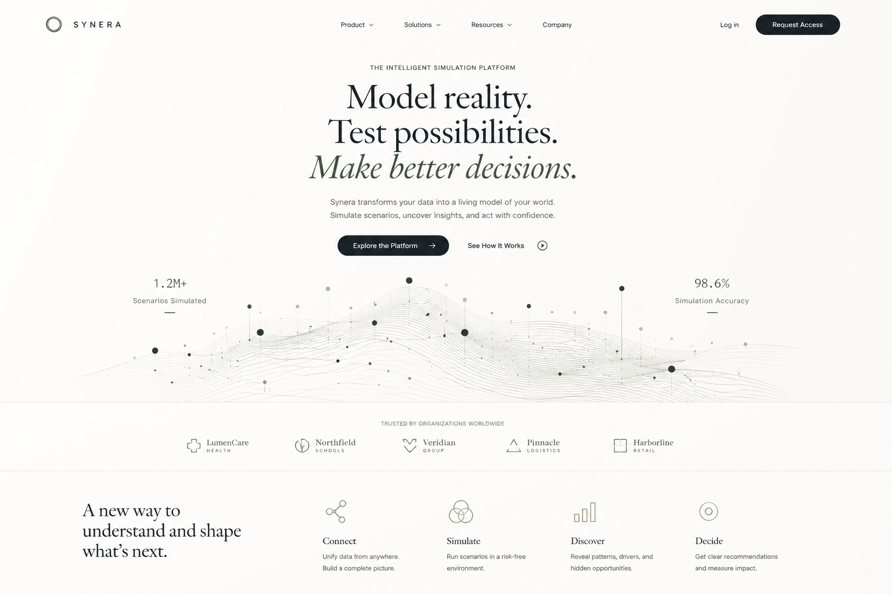
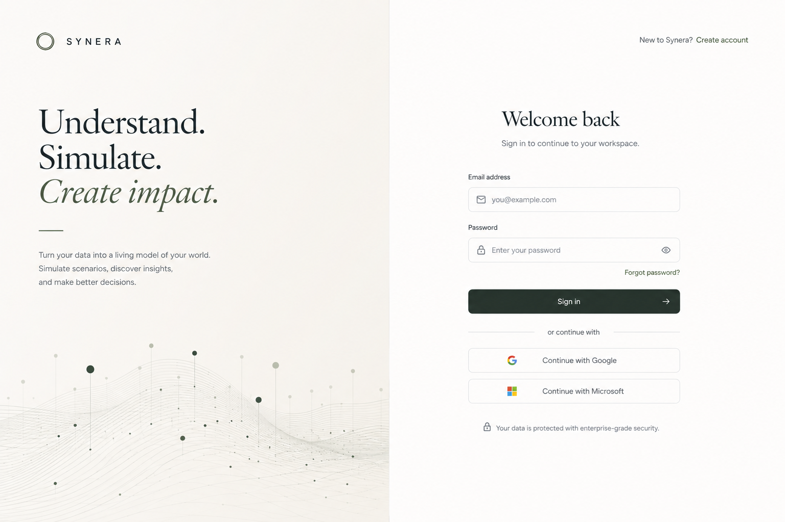
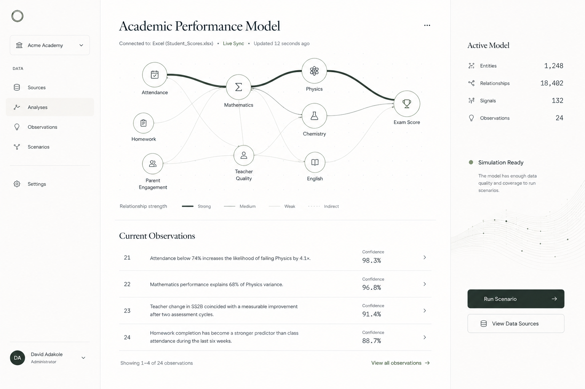
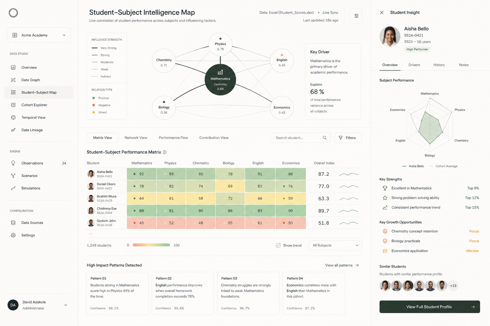

# Synera

<table>
  <tr>
    <td width="50%">
      
    </td>
    <td width="50%">
      
    </td>
  </tr>
  <tr>
    <td width="50%">
      
    </td>
    <td width="50%">
      
    </td>
  </tr>
</table>

### Synera is a data aggregation platform that allows anybody to interprete data and build applications all without interfacing with statistics or other abstract areas.

## Contents

* [Features](#features)
* [Synera Foundation UI](#foundation)
* [Team](#team)
* [Contact Us](#contact)
* [Scientific References](#science)
